<div align="center">

<a href="https://fabiobrito01.github.io/agentos-windows-toolkit/">
  
</a>

Uma coleção aberta de utilitários portáteis para manutenção, diagnóstico, backup, produtividade e desenvolvimento no Windows. **Clique no banner para abrir o catálogo interativo.**

[](https://www.microsoft.com/windows)
[](https://learn.microsoft.com/powershell/)
[](LICENSE)
[](index.html)

[Explorar catálogo](https://fabiobrito01.github.io/agentos-windows-toolkit/) · [Manual e segurança](docs/MANUAL.md) · [Contribuir](CONTRIBUTING.md) · [Reportar problema](../../issues)

</div>

## O que você encontra aqui

- **64 scripts rápidos** em Batch para tarefas do dia a dia.
- **3 ferramentas avançadas** para backup/restauração e documentação modular de projetos.
- **Catálogo web interativo** com pesquisa, filtros e indicação de risco.
- Caminhos portáteis: argumentos de linha de comando, `%USERPROFILE%`, `%CD%` ou seleção interativa.
- Uso local: nenhum instalador e nenhuma telemetria do projeto.

## Início rápido

1. Baixe o repositório em **Code → Download ZIP** ou use:

   ```powershell
   git clone https://github.com/fabiobrito01/agentos-windows-toolkit.git
   cd agentos-windows-toolkit
   ```

2. Consulte o [catálogo interativo](https://fabiobrito01.github.io/agentos-windows-toolkit/) e abra a ferramenta desejada.
3. Leia o cabeçalho e execute primeiro sem privilégios de administrador. Eleve apenas quando o catálogo indicar essa necessidade.

> [!CAUTION]
> Scripts marcados como **alto risco** podem alterar serviços, Registro, arquivos do sistema ou dados no destino. Faça backup, leia o código e confirme os caminhos antes de executar.

## Estrutura

```text
agentos-windows-toolkit/
├── scripts/                      # utilitários Batch independentes
├── tools/
│   ├── backup-restaurar/         # backup portátil com restauração
│   ├── gerar-markdown-modular/   # exporta projetos para Markdown
│   └── recriar-projeto-markdown/ # reconstrói exportações textuais
├── docs/                         # manual e auditoria
├── index.html                    # portal interativo (GitHub Pages)
└── README.md
```

## Compatibilidade

O alvo principal é Windows 10 e 11. Algumas ferramentas dependem de componentes opcionais como Git, Docker, FFmpeg, MySQL, SQLite, VeraCrypt, ADB ou WinGet. O [manual](docs/MANUAL.md) explica dependências e práticas seguras.

## Segurança e privacidade

Antes da publicação, o conteúdo foi revisado para remover caminhos pessoais, perfis privados, credenciais de exemplo inseguras e scripts cuja finalidade não era adequada para um catálogo público. Veja o [relatório de auditoria](docs/AUDITORIA_PUBLICACAO.md) e a [política de segurança](SECURITY.md).

## Licença

Disponibilizado sob a [licença MIT](LICENSE). Comandos do Windows e ferramentas externas continuam sujeitos aos termos dos respectivos fornecedores.
